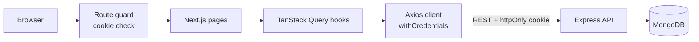

# Doctor Tracker: Frontend

Modern admin web app for **Doctor Tracker**, built with Next.js. Admins can manage doctors and their patients and read live analytics on a dashboard.

- Backend repository: `https://github.com/monirhabderabby/doctor-tracker-backend`
- Live app: `https://careguide.trustcheckbd.com`
- Live API: `https://careguideapi.trustcheckbd.com/api`

---

## Description

Doctor Tracker is a secure admin portal where clinic administrators manage doctors and patients in one place. After logging in, an admin can create and search doctors, add or remove patients under each doctor, review every patient from a dedicated page, and follow clinic activity through charts such as growth over time, patients per doctor and condition distribution. The interface is responsive, fast on large lists thanks to server-side search, filters and pagination, and keeps its state in the URL so any view can be refreshed or shared.

---

## Features

- **Authentication**: secure login with an httpOnly cookie session, protected routes, session tracking and logout.
- **Dashboard**: stat cards (total doctors, total patients, average patients per doctor, new this week) and three charts: growth timeline with a 7d / 30d / 12m toggle, patients per doctor, and condition distribution.
- **Doctors**: create, edit and delete; search, specialization and created-date filters, sorting and pagination.
- **Doctor details**: profile card with the doctor's patients, where you can search, filter, add and delete patients.
- **Patients**: dedicated page with search, condition, doctor and date filters, sorting, pagination, edit (including reassigning to another doctor) and delete.
- **UX**: responsive layout (table on desktop, cards on mobile), skeleton loaders, empty and error states, toasts, confirmation dialogs and accessible forms.

### Routes

| Route | Access | Purpose |
|---|---|---|
| `/login` | Public | Admin login |
| `/` | Protected | Dashboard analytics |
| `/doctors` | Protected | Doctor management |
| `/doctors/[id]` | Protected | Doctor profile and patients |
| `/patients` | Protected | Patient management |

Logged-in users who open `/login` are redirected to the dashboard, and logged-out users who open any protected route are redirected to `/login`.

---

## Tech Stack

| Area | Choice |
|---|---|
| Framework | Next.js (App Router), React, TypeScript |
| Styling / UI | Tailwind CSS, shadcn/ui |
| Server state | TanStack Query |
| Forms and validation | React Hook Form, Zod |
| Charts | Recharts (shadcn chart) |
| HTTP client | Axios (credentials enabled) |

---

## Setup Guide

### Prerequisites

- Node.js 20 or newer and npm
- The backend API running locally. Follow the setup guide in the backend repository first: `<BACKEND_REPO_URL>`

### Steps

```bash
# 1. Clone and enter the frontend folder
git clone https://github.com/monirhabderabby/doctor-tracker-website
cd doctor-tracker-website

# 2. Install dependencies
npm install

# 3. Create your env file
cp .env.example .env.local

# 4. Start the dev server
npm run dev
```

The app runs on `http://localhost:3000`. Log in with the admin credentials created by the backend seed script.

### Environment variables

A ready-to-copy template is in [`.env.example`](./.env.example).

| Variable | Description |
|---|---|
| `NEXT_PUBLIC_API_URL` | Base URL of the backend API, for example `http://localhost:5000/api` |

The backend must allow this app's origin in its `CLIENT_URL` setting, otherwise the browser will block the cookie.

### Scripts

| Script | Purpose |
|---|---|
| `npm run dev` | Start the dev server |
| `npm run build` | Create a production build |
| `npm start` | Run the production build |
| `npm run lint` | Run ESLint |

### Demo credentials

```
Email:    monir@monirhrabby.com
Password: 123456789
```

---

## System Architecture

The frontend is a separate Next.js client application that talks to the standalone Express API over REST. The session token lives in an httpOnly cookie that the API sets, so the browser sends it automatically and JavaScript can never read it.



### Data flow

1. The **route guard** (Next.js middleware) checks that the auth cookie exists before a protected page renders.
2. A page renders a feature component, which reads and writes data through **TanStack Query hooks**.
3. Hooks call small **API functions**, which use one shared **Axios instance** with credentials enabled.
4. The **Express API** validates the cookie and the request, queries MongoDB and returns JSON.
5. After a mutation (create, edit, delete), only the related query keys are invalidated, so lists and dashboard numbers refresh automatically.
6. If any request returns `401`, the app clears the session and sends the user to `/login`.

### Session tracking

Real validation always happens in the API. The frontend calls `GET /auth/me` through a `useAuth` hook to know who is logged in. The route guard only checks that the cookie exists, because the JWT secret never leaves the backend.

### Folder structure

The exact layout may differ slightly in the code, but the idea is the same everywhere: pages stay thin, features own their logic, and shared UI lives in one place.

```
src/
├── app/                    # Routes: (auth)/login and the protected dashboard routes
├── components/
│   ├── ui/                 # shadcn/ui primitives
│   ├── shared/             # Reusable pieces: pagination, filters, confirm dialog, empty state
│   └── Logo.tsx            # Doctor Tracker logo
├── hooks/                  # TanStack Query hooks and small UI hooks
├── schemas/                # Zod schemas (forms and query filters)
├── lib/                    # Axios instance, query keys, helpers
├── types/                  # Shared TypeScript types
└── constants/              # Option lists such as specializations and conditions
```

---

## Technical Decisions

### 1. TanStack Query for all server data, instead of Redux, Context or `useEffect` fetching

**Context.** Almost all state in this app is server state: doctor, patient and analytics lists that change often, are paginated, and are shared across several pages.

**Decision.** Every read uses `useQuery` and every write uses `useMutation`. Query keys come from one key factory, so invalidation is precise and typos are impossible.

**Why.**
- Caching, request de-duplication, loading and error states come for free, so there is no hand-written loading logic in components.
- `placeholderData: keepPreviousData` keeps the previous page on screen while the next one loads, so the table never flashes empty when filtering or paging.
- The next page is prefetched, so moving forward feels instant.
- Mutations invalidate only what they affect. Deleting a doctor refreshes the doctors list, that doctor's patients and the dashboard, and nothing else.
- Sensible `staleTime` values (30s for lists, 60s for dashboard data) avoid refetching on every navigation.

**Trade-offs.**
- It is another dependency and a new mental model (cache keys and invalidation) compared with plain `fetch`.
- Redux or Context would have been the wrong tool. They are meant for client state, and using them for server data means re-implementing caching, staleness and request status by hand.

### 2. URL search params as the source of truth for filters, sorting and pagination

**Context.** Doctors and patients pages combine search, several filters, sorting and pagination. The spec asks for a smooth, good-UX experience on large lists.

**Decision.** All list state lives in the URL, for example `/patients?search=karim&condition=Diabetes&page=2`. A Zod schema parses the params into typed filters, and the same filters feed the query key and the API request. Search input is debounced (400 ms) and only updates the URL after the user stops typing. Any filter change resets the page to 1.

**Why.**
- Refreshing, using the back button, or sharing a link restores exactly the same view.
- There is one source of truth, so the UI, the query key and the request cannot drift apart.
- Debouncing keeps the number of API calls low while typing.
- Filtering, search and pagination all run on the server, so the browser only ever holds one page of data and the app scales with the dataset.

**Trade-offs.**
- It needs a small hook to read, validate and write params, and care to keep the input responsive. The input keeps its own local value and syncs to the URL after the debounce.
- Very long filter state makes long URLs, which is acceptable for this feature set.

---

## Performance

- Server-side search, filters, sorting and pagination, so only one page of rows is loaded at a time.
- Debounced search and `keepPreviousData` to avoid unnecessary requests and layout flashing.
- Next-page prefetching.
- Charts are lazy loaded with `next/dynamic`, which keeps them out of the initial bundle.
- Client components only where interactivity is needed, with page shells kept as server components where possible.
- Memoization is applied selectively to heavy list rows and handlers, to avoid unnecessary re-renders.
- Forms and dialogs mount only when opened.

---

## Visual Evidence

### Desktop

| Login | Dashboard |
|---|---|
|  |  |

| Doctors | Doctor details |
|---|---|
|  |  |

| Patients | Add / edit form |
|---|---|
|  |  |

### Mobile

| Login | Dashboard | Doctors | Patients |
|---|---|---|---|
|  |  |  |  |

---

## Deployment Notes

- Set `NEXT_PUBLIC_API_URL` to the production API URL before building, because `NEXT_PUBLIC_` values are embedded at build time.
- The backend `CLIENT_URL` must exactly match this app's production origin.
- If the frontend and API are on different domains, the API cookie needs `SameSite=None; Secure`. Alternatively, proxy `/api` through the frontend domain or use sibling subdomains of one parent domain so the cookie is first-party.
